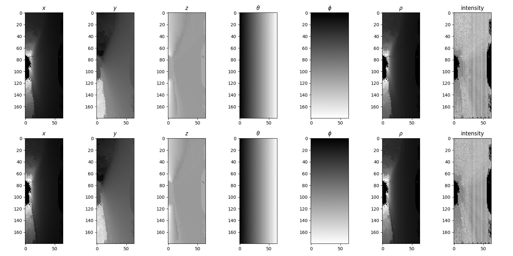

# ChipNet for LiDAR Point Cloud Segmentation

This application is to train and evaluate ChipNet for LiDAR Point Cloud Segmentation. <br>
This application takes `KITTI` binary files of LiDAR point cloud data as input and return the segmentation results. <br>
This program is based on ["ChipNet: Real-Time LiDAR Processing for Drivable Region Segmentation on an FPGA" by Yecheng Lyu, Lin Bai, and Xinming Huang (TCAS1 2019)](https://arxiv.org/pdf/1808.03506), and implemented by using `PyTorch`.

## DEMO

Input


Output


## Environment

- CUDA==10.0
- Python==3.8.5
- matplotlib==3.4.2
- numpy==1.21.0
- torch==1.4.0
- torchsummary==1.5.1
- torchvision==0.5.0
- tqdm==4.61.2

The versions of `torch` and `torchvision` should be compatible with the cuda version that you are using.

## Preparation

1. Clone this Repository

```bash
$ git clone https://github.com/hashi0203/ChipNet-LiDAR-Segmentation.git
```

2. Construct the enviroment

```bash
$ cd ChipNet-LiDAR-Segmentation
$ pip install -r requirements.txt
```

3. Download [KITTI Road dataset](http://www.cvlibs.net/datasets/kitti/eval_road.php)

    We used these two data provided in the official webpage.

    - [Download base kit with: left color images, calibration and training labels (0.5 GB)](http://www.cvlibs.net/download.php?file=data_road.zip)
    - [Download Velodyne laser point extension (1 GB)](http://www.cvlibs.net/download.php?file=data_road_velodyne.zip)

    After downloading dataset, unzip all data and place them as shown below. (We don't use test data because there are no ground truth images.)

    ```bash
    |-- ChipNet-LiDAR-Segmentation
        |-- data_road
            |-- training
                |-- calib
                |-- gt_image_2
                |-- image_2
                |-- velodyne
    ```

## Train

```bash
$ python3 train.py
```

### Options

- `--mse, -m`: use `MSE` instead of `Cross-entropy` for criterion
- `--progress, -p`: show progress bar when preparing dataset (It takes long time to prepare dataset)
- `--summary, -s`: show torchsummary to see the neural net structure

### Settings

We used `Adam` as optimizer, and run 150 epochs by using 80 data each of `um`, `umm`, and `uu`. <br>
The rest of the data is used for testing.<br>
Checkpoint and Learning curve are saved in `checkpoint` and `graph` directory, respectively.

### Checkpoint files

- `ckpt-0706-2335.pth`: Cross-entropy loss
- `ckpt-0706-2336.pth`: MSE loss

## Evaluation

```bash
$ python3 evaluate.py --file='/path/to/checkpoint/file'
```

You can change images used by changing `datanum` and `startidx` in `evaluate.py`.<br>
Input to the network and its output are saved in `result` directory.

## Result

### Learning Curve

|||
|:-------------------------------:|:-----------------------------:|
|Cross-entropy|MSE|

### Visualize

#### um_000094

Input


Output
|||
|:-------------------------------:|:-----------------------------:|
|Cross-entropy|MSE|

#### umm_000094

Input


Output
|||
|:-------------------------------:|:-----------------------------:|
|Cross-entropy|MSE|

#### uu_000094

Input


Output
|||
|:-------------------------------:|:-----------------------------:|
|Cross-entropy|MSE|

## Reference

```
@article{Lyu_2019,
   title={ChipNet: Real-Time LiDAR Processing for Drivable Region Segmentation on an FPGA},
   volume={66},
   ISSN={1558-0806},
   url={http://dx.doi.org/10.1109/TCSI.2018.2881162},
   DOI={10.1109/tcsi.2018.2881162},
   number={5},
   journal={IEEE Transactions on Circuits and Systems I: Regular Papers},
   publisher={Institute of Electrical and Electronics Engineers (IEEE)},
   author={Lyu, Yecheng and Bai, Lin and Huang, Xinming},
   year={2019},
   month={May},
   pages={1769–1779}
}
```